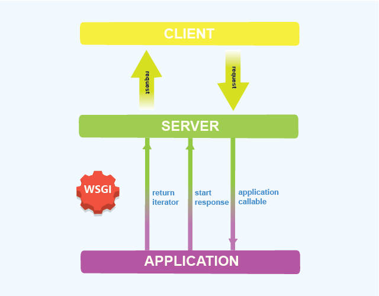

# Containers 

## Working with Docker 


To start, ensure that the `docker` VM is running on your local machine:
```bash
vagrant global-status --prune
```
You should see output similar to:
```sh
id       name   provider   state   directory
-----------------------------------------------------------------
616e062  docker virtualbox running /Users/<MSID>/devops_workshops
```

SSH into the `docker` VM and ensure that Docker is installed and running:
```bash
$ vagrant ssh docker
$ docker version
```

You should output similar to the following:
```
Client:
 Version:           18.09.6
 API version:       1.39
 Go version:        go1.10.8
 Git commit:        481bc77
 Built:             Sat May  4 02:35:27 2019
 OS/Arch:           linux/amd64
 Experimental:      false

Server: Docker Engine - Community
 Engine:
  Version:          18.09.6
  API version:      1.39 (minimum version 1.12)
  Go version:       go1.10.8
  Git commit:       481bc77
  Built:            Sat May  4 01:59:36 2019
  OS/Arch:          linux/amd64
  Experimental:     false
```


### Docker Run
Docker containers are built from Docker images. 
By default, Docker pulls these images from Docker Hub, a Docker registry managed by Docker, 
the company behind the Docker project. 
Anyone can host their Docker images on Docker Hub, so most
applications and Linux distributions you'll need will have images hosted there. 


Run the following command to spin up an Apache server that servers a "Hello World" page listening on port 80, as a Docker
container:
```bash
$ docker run -d -p 80:80  --name "hello-world" dockercloud/hello-world
```
- The `-d` flag runs the container in the background and prints the container ID.  
- The `-p` flag publishes the containers port to the host machine. 
In this example, we are publishing port 80 of the Docker machine to port 80 of the host machine, 
so that we can access the application from our host machine.

- `dockercloud/hello-world` is the image name that we are pulling from here: https://hub.docker.com/r/dockercloud/hello-world.

Docker Hub is a hosted repository service provided by Docker for finding and sharing container images.  
Optum has a Docker Trusted Registry (DTR) as well, for securely storing and managing Docker images 
behind our firewall: docker.optum.com  


You should see output similar to the one below:
```
Unable to find image 'dockercloud/hello-world:latest' locally
latest: Pulling from dockercloud/hello-world
486a8e636d62: Pull complete
03374a673b41: Pull complete
101d2c41032c: Pull complete
1252e1f36d2b: Pull complete
8385bb1a4377: Pull complete
f29c06131731: Pull complete
Digest: sha256:c6739be46772256abdd1aad960ea8cf6c6a5f841c12e8d9a65cd5ef23bab45fc
Status: Downloaded newer image for dockercloud/hello-world:latest
b0f228753f037ab2dc2df06ae96019f22af45023b6ac1a0d53237b2de9c7d751
```
Here, we can see that Docker is pulling the `latest` tagged image from `dockercloud/hello-world` by default, since we did not
explicitly specify an image tag.


Since this is the first time Docker is running this image, it will first download the image to your local machine.
Finally, Docker will spin up a container with the image, and print the container ID associated with the new container.

Now, navigate to `172.28.33.10:80` in your web browser, you should see the "Hello world!" page, with the hostname being the
Container ID of your docker container.


### Docker Images

You can view the images that you have currently downloaded on your local machine with the following command:
```bash
$ docker images
```

You should see output similar to:
```
REPOSITORY                TAG                 IMAGE ID            CREATED             SIZE
dockercloud/hello-world   latest              0b898a637c19        23 months ago       30.8MB
```


### Docker Containers
You can view all the currently running containers with:
```bash
$ docker ps
```

You should see output similar to:
```
CONTAINER ID        IMAGE                     COMMAND                CREATED              STATUS              PORTS                NAMES
b0f228753f03        dockercloud/hello-world   "/bin/sh -c /run.sh"   About a minute ago   Up About a minute   0.0.0.0:80->80/tcp   hello-world
```

To view all containers, both active and inactive, you can run:
```bash
$ docker ps -a
```


### Interacting with Docker Containers
You can run commands in a running container as well using `docker exec`.

To open an interactive shell, you can pass the `-it` flags like so:
```bash
$ docker exec -it b0f228753f03 /bin/sh
```

`b0f228753f03` is the Container ID in this case.

You can also view the logs of your container:
```bash
$ docker logs -f <container name|ID>
```
Paassing the `-f` flag will follow the logging output.


To get low-level information about Docker objects, you can also use the `docker insepct` command.

`docker rm <container name|ID>` will remove the container.  
`docker rm -f $(docker ps -aq)` will remove all containers.

`docker system prune --all -f` will remove:
  - all stopped containers
  - all networks not used by at least one container
  - all images without at least one container associated to them
  - all build cache


### Environment Variables
You can also pass flags to `docker run` to set environment variables for containers.


Recall the `dockercloud/hello-world` image that we first ran.  
If you read the [documentation](https://hub.docker.com/r/dockercloud/hello-world), you will find that
we can set the LISTEN_PORT to a different port instead of port 80 using an environment variable.

Run the `dockercloud/hello-world` container again, but this time,a pass the `-e` flag to set the LISTEN_PORT environment
variable to port 3000.   
Notice how the arguments for the ports to be published have changed as well as a result.

```bash
$ docker run -d -p 3000:3000 -e LISTEN_PORT=3000 --name "hello-world-2" dockercloud/hello-world
```

Navigate to `172.28.33.10:3000`, and notice how the hostname is different from the one found at `172.28.33.10:80`.  
This is because we are running two different containers (albeit the same image) on two different ports.  


### Managing Application Data
##### Bind Mounts

When you use a bind mount, a file or directory on the host machine is mounted into a container.  
This can be useful in a few scenarios.  
Consider a use case where we want to host a simple, static website using an NGINX server.

Let's begin by running a container with the NGINX server.   
Because we already have a container running on port 80, let's map the container's default port 80 to port 8080 on our
host machine:

```bash
$ docker run -d --name "default-nginx" -p 8080:80 nginx:alpine
```

Once the container is running, navigate to `172.28.33.10:8080` in your web browser. 
You should see the default "Welcome to nginx!" landing page.

Let's mount a "bind mount" with a different index.html file, and have the NGINX server serve that instead.
To start, create a new `index.html` file:

```bash
$ cat > index.html << EOF
<html>
    <body>
        <h1>Hello Optum!</h1>
    </body>
</html>
EOF
```

Then start up another NGINX container, but this time, pass the `-v` flag to mount the current working directory of your
host machine where the index.html file is located to the `/usr/share/nginx/html` directory of the NGINX container.

Because we're already running the `default-nginx` container on port 8080, let's also change the host port to port 8081:

```bash
$ docker run -d --name "hello-optum" -p 8081:80 -v $(pwd):/usr/share/nginx/html:ro nginx:alpine
```

Now go to `172.28.33.10:8081` in your browser. 
You should see your new index.html file being served instead of the default NGINX landing page now.


What happens if you change the contents of the `index.html` file from your host machine and then reload your web page?

##### Volumes 
Bind mounts have limited functionality compared to volumes.

Volumes are the preferred mechanism for persisting data generated by and used by Docker containers.   
While bind mounts are dependent on the directory structure of the host machine, volumes are completely managed by Docker.   

Volumes have several advantages over bind mounts:    
  - Volumes are easier to back up or migrate than bind mounts.
  - You can manage volumes using Docker CLI commands or the Docker API.
  - Volumes work on both Linux and Windows containers.
  - Volumes can be more safely shared among multiple containers.
  - Volume drivers let you store volumes on remote hosts or cloud providers, to encrypt the contents of volumes, or to add other functionality.
  - New volumes can have their content pre-populated by a container.


In addition, volumes are often a better choice than persisting data in a container’s writable layer,   
because a volume does not increase the size of the containers using it, and the volume’s contents exist outside the lifecycle of a given container.  

Consider a use case where we would want to be able to save the logs of a running application in a container 
for auditing and security purposes.


### Building your own Docker image with Dockerfiles
A Dockerfile is a text document that contains all the commands a user could call on the command line to assemble an
image.

Let's take a look at the Dockerfile for an example Flask application, in the flask_app/ directory:
```Dockerfile
FROM python:alpine3.9
LABEL maintainer some-random-TDP
COPY . /app
WORKDIR /app
RUN pip install -r requirements.txt
EXPOSE 5000
ENTRYPOINT ["python", "app.py"]
```

- The `FROM` instruction specifies the Base Image from which you are building.
In this case, we are building from a [Python](https://hub.docker.com/_/python) base image.
- The `LABEL` instruction allows us to add metadata to the image as a key-value pair.
- The `COPY` instruction  copies new files or directories from a source location, and adds them to the filesystem of the
  container.
- The `WORKDIR` instruction sets the working directory for any `RUN`, `CMD`, `ENTRYPOINT`, `COPY`, and `ADD`
  instructions that follow it in the `Dockerfile`.
- The `RUN` instruction allows us to run shell commands. a
- The `EXPOSE` instruction informs Docker that the container listens on the specified network port(s) at runtime. 
- The `ENTRYPOINT` instruction allows you to configure a container that will run as an executable.


For more information, you can look at the 
[Dockerfile reference docs](https://docs.docker.com/engine/reference/builder/).


Now let's navigate to the flask_app/ directory, and build the Docker image for this example Flask app:
```bash
$ cd flask_app
$ docker build -t example-flask-app:latest .
```

Notice how Docker creates container images using layers.   
Each command that is found in a Dockerfile creates a new layer.  
Each layers contains the filesystem changes of the image between the state before the execution of the command and the state after the execution of the command.

Docker uses a layer cache to optimize the process of building Docker images, making it faster.

Once Docker is finished building the image, you can then check to see that the image is now available locally.  
Notice how there are two images.

```
REPOSITORY          TAG                 IMAGE ID            CREATED             SIZE
example-flask-app   latest              5e71956c4719        4 seconds ago       72.8MB
python              alpine3.9           ee70cb11da0d        7 days ago          61.3MB
```

Try running the `example-flask-app` container image that you just built.  
You should be able to navigate to `172.28.33.10:5000` and see "Flask inside Docker!".


### Pushing your Images to a Repository
Now that you have an image built for your application, 
you'll want to push it to a repository for sharing and storing.

This requires that you have an account created for the repository that you're pushing to, 
so we won't go into too much detail in this excercise.

The basic guidelines consist of:
1. Logging into the repository.
2. Ensuring that your image is tagged properly to your account.
3. Pushing your image to the repository.

```bash
$ docker login <repository server if different from hub.docker.com>
$ docker tag <image ID> <your dockerhub username>/example-flask-app:latest
$ docker push <your dockerhub username>/example-flask-app:latest
```

---
## Defining & Running multi-container applications with Docker Compose


Compose is a tool for defining and running multi-container Docker applications.  
To learn more about Compose, you can refer to the [documentation here](https://docs.docker.com/compose/).

Check that docker-compose is installed and running:
```
$ docker-compose version
```
You should see output similar to the following:
```
docker-compose version 1.24.0, build 0aa59064
docker-py version: 3.7.2
CPython version: 3.6.8
OpenSSL version: OpenSSL 1.1.0j  20 Nov 2018
```

Using Compose is basically a three-step process.

  1. Define your app's environment with a Dockerfile so it can be reproduced anywhere.
  2. Define the services that make up your app in docker-compose.yml so they can be run together in an isolated environment.
  3. Lastly, run `docker-compose up` and Compose will start and run your entire app.


### Running a Flask + NGINX stack
Let's return to our Flask application example.  
While lightweight and easy to use, Flask’s built-in server is not suitable for production 
as it doesn’t scale well and by default serves only one request at a time.

To solve this, we can deploy an NGINX reverse proxy that communicates to the Flask server 
via a WSGI (Web Server Gateway Interface):



Take a look at the example Flask + NGINX application in the flask_nginx/ directory.  
The directory is organized such that the two different components are in two separate sub-directories:

```
flask_nginx/
|
|__docker-compose.yml
|
|__flask/
|   |__Dockerfile-flask
|   |__requirements.txt
|   |__app.ini
|   |__app.py
|
|__nginx/
    |__Dockerfile-nginx
    |__app.conf
```

Navigate to the flask_nginx/ directory and spin up this multi-container application using Docker Compose.
```bash
$ cd flask_nginx
$ docker-compose up
```

Try to follow the resulting output to understand what Compose is doing.

Navigate to `172.28.33.10:8082`, and you should be able to see "Hello World in Production!"

Let’s walk through the important lines on our docker-compose.yml file to fully explain what is going on.

```Dockerfile
version: '3.7'
services:
  flask:
    image: webapp-flask
    build:
      context: ./flask
      dockerfile: Dockerfile-flask

  nginx:
    image: webapp-nginx
    build:
      context: ./nginx
      dockerfile: Dockerfile-nginx
    ports:
      - 8082:80
    depends_on:
      - flask
```


`version: 3.7` specifies the Compose file format version we are using.

The keys under `services:` defines the names of each one of our services (i.e. Docker containers). 
In this example, flask and nginx are the names of our two containers.

`image: webapp-flask`
This line specifies what name our image will have after docker-compose creates it.  It can be anything we want.   
Docker Compose will build the image the first time we launch docker-compose up and keep track of the name 
for all future launches.

```
build:
  context: ./flask
  dockerfile: Dockerfile-flask
```

This section is doing two things.   
First, it is telling the Docker engine to only use files in the flask/ directory to build the image. 
Second, it’s telling the engine to look for the Dockerfile named Dockerfile-flask 
to know the instructions for building the appropriate image.

For the nginx portion of the file, there’s a few things to look out for.
```
ports:
  - 8082:80
```

This little section is telling Docker Compose to map the port 8082 on the host machine 
to port 80 on the NGINX container (which is the port Nginx serves to by default).  

```
depends_on:
  - flask
```

The `depends_on:` directive tells Compose to wait until the flask container 
is in a functional state before launching the nginx container, 
which avoids having a scenario where NGINX fails when the flask host is unresponsive.

By default Compose sets up a single network for your app.   
Each container for a service joins the network created
and is both reachable by other containers on that network, 
and discoverable by them at a hostname identical to the container name.

This is why in our nginx/app.conf file, 
we are able to reference the flask server with the hostname "flask".

Compare using Docker Compose to the alternative below:
```bash
$ docker build -t my-flask -f flask/Dockerfile-flask flask/
$ docker build -t my-nginx -f nginx/Dockerfile-nginx nginx/

$ docker network create my-network

$ docker run -d --name flask --net my-network -v "$(pwd)/flask/:/app" my-flask
$ docker run -d --name nginx --net my-network -p "5000:80" my-nginx
```

Type `CTRL+C` to stop the two containers.  

