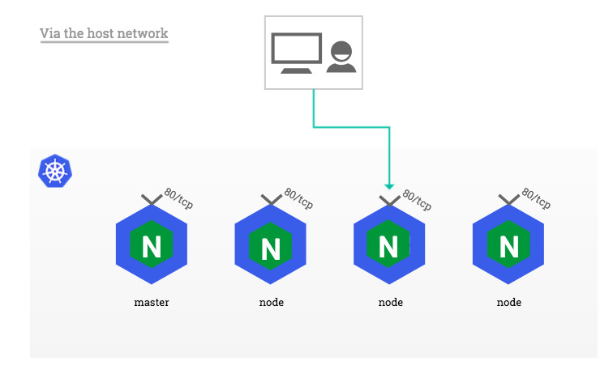

# Container Orchestration 

## Working with Kubernetes
This workshop assumes that the user has an introductory understanding of Kubernetes resources,   
ie: Pods, Deployments, ReplicaSets, etc.   
These foundational topics are covered in the 01_container_orchestration_openshift workshop.


To start, ensure that the `kubernetes` VM is running on your local machine:
```bash
$ vagrant global-status --prune
```
You should see output similar to:
```sh
id       name      provider   state   directory
--------------------------------------------------------------------
4c56060  kubernetes virtualbox running /Users/<MSID>/devops_workshops
```

SSH into the kubernetes training VM:

```sh
$ vagrant ssh kubernetes
```

### Accessing the Dashboard
The Kubernetes Dashboard is a general purpose, web-based UI for Kubernetes clusters. 
It allows users to manage applications running in the cluster and troubleshoot them, as well as manage the cluster itself.

The access the dashboard from our host computer, we must first expose the service via port-forwarding.  
A Kubernetes Service is an abstraction which defines a logical set of Pods and a policy by which to access them.
```sh
$ kubectl port-forward -n kube-system service/kubernetes-dashboard 10443:443 --address 0.0.0.0
```

Navigate to the kubernetes UI at https://172.28.33.40:8443/console in a web browser on your local host machine.

Login using the token provided for when you ran the command: `$ vagrant up kubernetes`.

Take some time to familiarize yourself with the dashboard.

While the dashboard provides a nice interface for getting an overview of applications running on your cluster,   
as you continue to mature in your usage and understanding of Kubernetes, you will no doubt, find it limiting in many ways.  

Therefore, the rest of this workshop will utilize the `kubectl` CLI tool instead. :smile:


### Using Namespaces
Namespaces provide a logical way to divide cluster resources between multiple users/teams/environments.
They allow you to organize and manage your content.

To start, create a new namespace and name it "my-project":  
```sh
$ kubectl create namespace my-project
```

If you request for all namespaces in your cluster, 
you should now see that a new namespace named "my-project" that has been created:

```sh
$ kubectl get namespaces
NAME                 STATUS   AGE
container-registry   Active   13m
default              Active   13m
ingress              Active   13m
kube-node-lease      Active   13m
kube-public          Active   13m
kube-system          Active   13m
my-project           Active   103s
```


### Creating a Deployment
The following is an example of a Deployment manifest. 
It creates a ReplicaSet to bring up 3 NGINX Pods:
```yaml
apiVersion: apps/v1
kind: Deployment
metadata:
  name: nginx-deployment
  labels:
    app: nginx
spec:
  replicas: 3
  selector:
    matchLabels:
      app: nginx
  template:
    metadata:
      labels:
        app: nginx
    spec:
      containers:
      - name: nginx
        image: nginx:1.17.6
        ports:
        - containerPort: 80
```


Now, deploy your NGINX pods into the "my-project" namespace:
```sh
$ kubectl apply -f kubernetes/nginx_deployment.yaml -n my-project
```

You can view your deployment with the following command:
```sh
$ kubectl get deployments -n my-project
NAME               READY   UP-TO-DATE   AVAILABLE   AGE
nginx-deployment   3/3     3            3           7s
```

Likewise, with the 3 NGINX pods:
```sh
$ kubectl get pods -n my-project
NAME                                READY   STATUS    RESTARTS   AGE
nginx-deployment-7cd5ddccc7-jxkjw   1/1     Running   0          21s
nginx-deployment-7cd5ddccc7-z2svb   1/1     Running   0          21s
nginx-deployment-7cd5ddccc7-z8j2d   1/1     Running   0          21s
```

### Exposing your application to in-cluster traffic using ClusterIP
Now that your application has been successfully deployed, 
you will want to be able to route traffic to/from your application.

In Kubernetes, a Service is an abstraction which defines a logical set of Pods 
and a policy by which to access them (sometimes this pattern is called a micro-service).   
The set of Pods targeted by a Service is usually determined by a selector.

For example, consider a stateless image-processing backend which is running with 3 replicas.   
Those replicas are frontends that do not care which backend they use.  
While the actual Pods that compose the backend set may change, the frontend clients should not need to be aware of that, 
nor should they need to keep track of the set of backends themselves.

The Service abstraction enables this decoupling.

The following is an example of a Service manifest that targets the NGINX deployment that we previously created:
```yaml
apiVersion: v1
kind: Service
metadata:
  name: nginx-service
spec:
  selector:
    app: nginx
  ports:
    - protocol: TCP
      port: 80
      targetPort: 80
```

Create the service:
```sh
$ kubectl apply -f kubernetes/nginx_service.yaml -n my-project
```

You should now be able to access your NGINX pods from within the cluster via the provided Cluster IP address, which you
can query for:
```sh
$ kubectl get services -n my-project
NAME            TYPE        CLUSTER-IP       EXTERNAL-IP   PORT(S)   AGE
nginx-service   ClusterIP   10.152.183.240   <none>        80/TCP    2m6s
```


### Exposing your application to external traffic
To access our NGINX application from our host-machine, we have a couple of options:

#### Using port-forward
We can simply port-forward the pod, if we only need to access the application from our local machine temporarily for
development purposes.  
Some common use cases may be if we're developing a microservice locally that is dependent on another shared service or database that
has been deployed on a remote kubernetes cluster.

To port-forward a pod, you can use the following command:
```sh
$ kubectl port-forward <pod-name> <host-port>:<container-port> -n my-project
```

For example, to port-forward one of the 3 NGINX pods that are currently deployed:

```sh
$ kubectl port-forward $(kubectl get pod -n my-project | awk '{print $1}' | tail -1) 8080:80 -n my-project --address 0.0.0.0
```

The `--address 0.0.0.0` flag is used here so that we can access the applicaation from our host machine. 
Otherwise, application would only be accessible from the guest VM on localhost.

Now, navigate to http://172.28.33.40:8080 in your web browser to access the NGINX application.


#### Using NodePort
Type NodePort allows you to expose expose the Service on each Node’s IP at a static port (the NodePort).  
This can be a relatively quick and easy way to expose your application, but limits your ability to provide fine-grained
traffic routing controls, and requires that you take care about possible port collisions yourself.     
You also have to use a valid port number, one that’s inside the range configured for NodePort use (default: 30000-32767).

The following is an example of a Service manifest that targets the NGINX deployment that we previously created, 
but also specifies that the service be published via a NodePort on port 30100.  
```yaml
apiVersion: v1
kind: Service
metadata:
  name: nginx-service
spec:
  type: NodePort
  selector:
    app: nginx
  ports:
    - protocol: TCP
      port: 80
      targetPort: 80
      nodePort: 30100
```

Query for the node IP address of our single-node cluster:
```sh
$ kubectl get nodes -o wide
NAME         STATUS   ROLES    AGE   VERSION   INTERNAL-IP   EXTERNAL-IP   OS-IMAGE             KERNEL-VERSION      CONTAINER-RUNTIME
kubernetes   Ready    <none>   65m   v1.17.0   10.0.2.15     <none>        Ubuntu 18.04.3 LTS   4.15.0-70-generic   containerd://1.2.5
```

Finally, test that you can access the NGINX application from the guest VM:
```sh
$ curl 10.0.2.15:30100
<!DOCTYPE html>
<html>
<head>
<title>Welcome to nginx!</title>
<style>
    body {
        width: 35em;
        margin: 0 auto;
        font-family: Tahoma, Verdana, Arial, sans-serif;
    }
</style>
</head>
<body>
<h1>Welcome to nginx!</h1>
<p>If you see this page, the nginx web server is successfully installed and
working. Further configuration is required.</p>

<p>For online documentation and support please refer to
<a href="http://nginx.org/">nginx.org</a>.<br/>
Commercial support is available at
<a href="http://nginx.com/">nginx.com</a>.</p>

<p><em>Thank you for using nginx.</em></p>
</body>
</html>
```

#### Using LoadBalancer with Ingress
Type LoadBalancer exposes the Service externally using a cloud provider's load balancer.  
The following is an example of a Service manifest that targets the NGINX deployment that we previously created, 
and also specifies that the service be published via a LoadBalancer.

```yaml
apiVersion: v1
kind: Service
metadata:
  name: nginx-service
spec:
  selector:
    app: nginx
  ports:
    - protocol: TCP
      port: 80
      targetPort: 80
  type: LoadBalancer
```

This would work if, our Kubernetes cluster was deployed on a cloud provider that supports using a Service in LoadBalancer mode 
to set up external HTTP/HTTPS reverse proxying, forwarded to the Endpoints of the Service 
(ie: for Microsoft Azure, see [https://docs.microsoft.com/en-us/azure/aks/load-balancer-standard](Azure Load Balancer) for details).

Unfortunately, for this workshop, our Kubernetes workshop is deployed on a local bare metal VM. 
However, we can still expose our service using Ingresses!  

Ingress exposes HTTP and HTTPS routes from outside the cluster to services within the cluster. 
Traffic routing is controlled by rules defined on the Ingress resource.

  

An Ingress can be configured to give Services externally-reachable URLs, load balance traffic, terminate SSL / TLS, and offer name based virtual hosting. 
An Ingress controller is responsible for fulfilling the Ingress, usually with a load balancer, though it may also configure your edge router or additional frontends to help handle the traffic.
In other words, an Ingress Controller is a daemon, deployed as a Kubernetes Pod, that watches the apiserver's /ingresses endpoint 
for updates to the Ingress resource. Its job is to satisfy requests for Ingresses.

For this workshop, we will be working with one of the most common ingress controllers: [NGINX](https://github.com/kubernetes/ingress-nginx/)
There are of course, other [ingress controllers available](https://kubernetes.io/docs/concepts/services-networking/ingress-controllers/#additional-controllers),
each with their pros and cons.  

Now, there are a few ways in which we can architect the ingress networking of our cluster.

One method is via a NodePort:

  

Alternatively, we can configure the ingress pods to use the network of the host they run on instead of a dedicated network namespace.

  

The benefit of this approach is that the NGINX Ingress controller can bind ports 80 and 443 directly to Kubernetes
nodes' network interfaces, without the extra network translation imposed by NodePort Services.

However, one major limitation of this deployment approach is that only a single NGINX Ingress controller Pod may be
scheduled on each cluster node, because binding the same port multiple times on the same network interface is
technically impossible.

For simplicity, we will be configuring our ingress controller to use the host network of our VM.
```sh
$ kubectl apply -f kubernetes/nginx_ingress_controller.yaml
```

Finally, we need to create our Ingress resource to proxy external requests to our nginx-service.
The following is an example of a Ingress manifest that targets the NGINX service that we previously created.
```yaml
apiVersion: networking.k8s.io/v1beta1
kind: Ingress
metadata:
  name: ingress-nginx
spec:
  rules:
  - http:
      paths:
      - backend:
          serviceName: nginx-service
          servicePort: 80
```

Create the ingress resource:
```sh
$ kubectl apply -f kubernetes/nginx_ingress.yaml
```

You should now be able to navigate to 172.28.33.40 in your local web browser, and see the NGINX default page.

Of course, there are a lot more things that you can do with Ingress Controllers, more than we can cover in this section.    
Hopefully this gives you a basic understanding of how you can leverage ingress resources to perform traffic management!  

### Using Helm to manage deployments and releases

### Understanding the Operator Framework
N X
