# Container Orchestration 

  


## Working with OpenShift
To start, ensure that the `openshift` VM is running on your local machine:
```bash
$ vagrant global-status --prune
```
You should see output similar to:
```sh
id       name      provider   state   directory
--------------------------------------------------------------------
4c56060  openshift virtualbox running /Users/<MSID>/devops_workshops
```

Navigate to the OpenShift UI at https://172.28.33.20:8443/console in a web browser on your local machine.

Login as a developer with the following credentials:
```sh
Username: developer
Password: <any value>
```


### Using Projects & Namespaces
OpenShift Projects are the equivalent of Kubernetes namespaces.
Projects/Namespaces provide a logical way to divide cluster resources between multiple users/teams/environments.
They allow you to organize and manage your content.

To start, create a new project and name it "my-project":  
When you first login, you should see an initial developer project 
called "My Project" created for you on the right side.


### Creating an Application

The first page you'll see when you login is the OpenShift Catalog, 
where the good folks at Red Hat have create a few starter applications 
that can be deployed to OpenShift with minimal fuss from you, the end-user.

Let's try deploying the NGINX HTTP server that is already provided for in the Catalog.


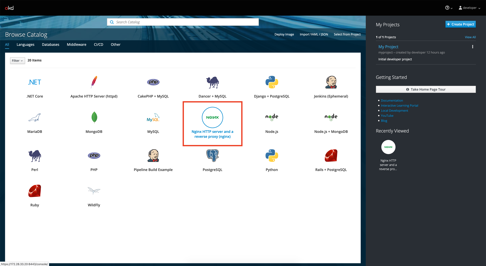

Use version "1.12 - latest", name your application "my-nginx", 
and use "https://github.com/sclorg/nginx-ex.git" as the Git repo.

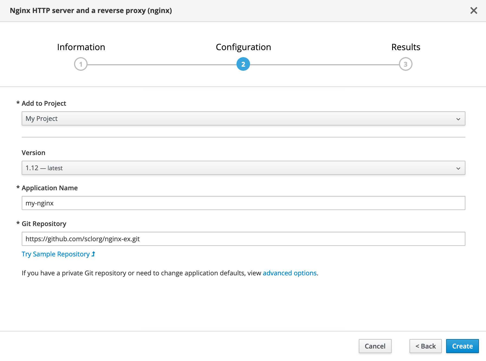

Then click "Create".

Once the application is created, 
navigate to the [Overview](https://172.28.33.20:8443/console/project/myproject/overview) page of your project.

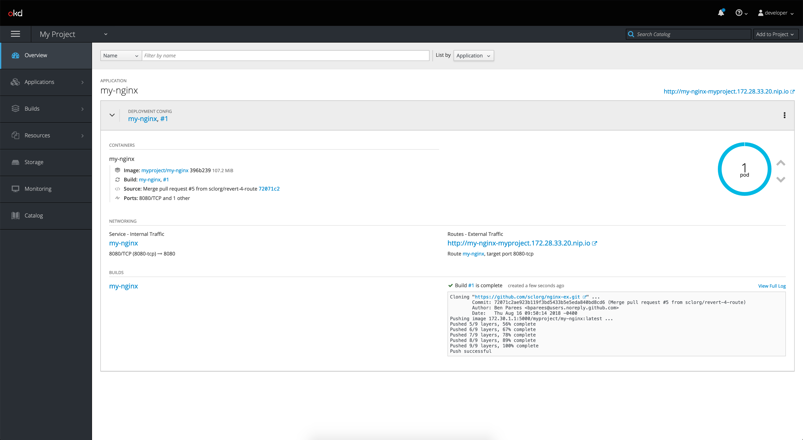

You should see that the NGINX application has been created.

Go ahead and navigate to the route that was generated for the deployed NGINX application:
http://my-nginx-myproject.172.28.33.20.nip.io .

You should see a "Welcome to Openshift" page.


#### Breaking it Down
As you can see, OpenShift makes it relatively easy to quickly deploy applications as containers,
but there's actually a lot that's going on here.

1. OpenShift first clones the repo where the source code is, and then 
[builds](https://172.28.33.20:8443/console/project/myproject/browse/builds) an image.
There are a number of 
[build strategies](https://docs.openshift.com/container-platform/3.9/architecture/core_concepts/builds_and_image_streams.html#builds)
that can be used here. In this case, we are using a "Source-to-Image (S2I)" build strategy.  
We won't go into the details on the differences between them all, as that is outside the scope of this workshop,
but just know that the idea is the same as `$ docker build`.

2. The built image is then pushed to a repository.   
This can be any repository we choose (hub.docker.com, docker.optum.com, Nexus, JFrog Artifactory, etc.).   
In this case, OpenShift has an integrated repository that is being hosted internally to the cluster at `172.30.1.1:5000`,
that we will use.  
(If you don't believe me, ssh into the openshift VM and list the running Docker containers :wink: )

3. An "[Image Stream](https://172.28.33.20:8443/console/project/myproject/browse/images)" resource is created,
 which provides an abstraction for referencing Docker images from within OpenShift.
This allows other OpenShift objects to automatically perform actions based on changes to Docker images, such as
triggering a new deployment update or build. 
**Note:** "Image Streams" are unique to OpenShift, and are not supported in default Kubernetes.

4. A "[Deployment Configuration](https://172.28.33.20:8443/console/project/myproject/browse/dc/my-nginx?tab=history)" 
object is created, which details how the application should be deployed and managed. 
(ie: number of replicas, readiness/liveliness probes, ports to be exposed, env variables, image to be deployed, etc.)  
The DeploymentConfiguration object defines the following details of a deployment:
    - The elements of a ReplicationController definition.
    - Triggers for creating a new deployment automatically.
    - Strategies for transitioning between deployments. 
    - Life cycle hooks.      

    Note: "Deployment Configurations" are unique to OpenShift and provide greater flexibility and configuration options than
    their superclass, "Deployments", such as image change deployment triggers. 
    DeploymentConfig resources are not supported in default Kubernetes.   

5. According to the specifications detailed in the DeploymentConfiguration, a Replication Controller
is created to ensure that the specified number of replicas of a pod are running at all times.
The definition of a replication controller consists mainly of:  
    - The number of replicas desired.  
    - A pod definition for creating a replicated pod.  
    - A sector for identifying managed pods.  

6. According to the Replication Configuration created, the requested number of 
[Pods](https://172.28.33.20:8443/console/project/myproject/browse/pods) resources are created.

7. A [Service](https://172.28.33.20:8443/console/project/myproject/browse/services/my-nginx?tab=details) 
resource is also created for routing traffic internal to the cluster.

8. A [Route](https://172.28.33.20:8443/console/project/myproject/browse/routes/my-nginx) 
resource is created for routing traffic external to the cluster. 
This is the endpoint that allows us to visit the "Welcome to Openshift" page from our web browser.

Take some time and familiarize yourself with the OpenShift console.   
View the logs and events pages and see if you can follow the many different steps involved in deploying a containerized
application on OpenShift.

### Horizontally Scaling your Application

Try scaling the NGINX application to 3 pods.

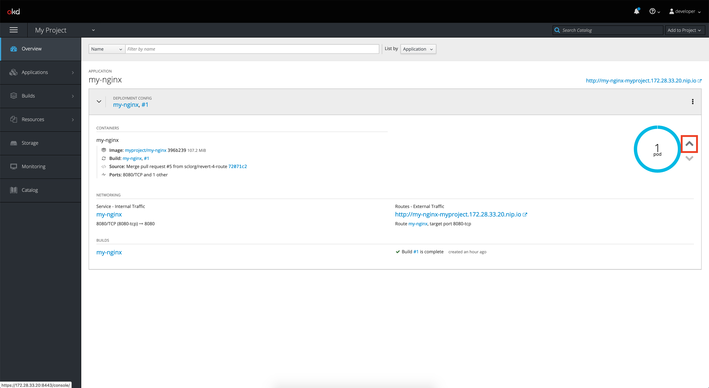


### Using the CLI to Manage Resources

Eventually, you will want to get to the point where you can automate your deployments and OpenShift objects 
using scripts and the CLI.

SSH into the openshift VM and login as a developer:
```bash
$ vagrant ssh openshift
$ oc login -u developer
```

Run `oc get all` to view the resources currently running in your project.

Let's take a close look at the deployment config for the NGINX application:
```bash
$ oc describe dc my-nginx
```
Try "describing" other OpenShift objects.

OpenShift objects are defined as yaml files.
Try taking a look at the yaml file specification for the NGINX deployment config:
```bash
$ oc get dc my-nginx -o yaml
```

You can also view the logs from pods via the CLI:
```bash
$ oc logs -f <pod name>
```

You can also edit any resources directly from the CLI as well.  
Try changing the number of "replicas" for the NGINX application to 2.  
```bash
$ oc edit dc my-nginx
```

We will explore the use of yaml template files later.


### Deploying Your Own Application 

Let's deploy the example flask + NGINX multi-container application from the previous workshop, using the CLI.

Note that we are choosing to use the [bitnami](https://hub.docker.com/r/bitnami/nginx) 
version of NGINX instead of a "regular" [nginx image](https://hub.docker.com/_/nginx/) because
the bitnami image does not run as root.

There are security concerns with Docker containers that run as root, and
OpenShift has controls in place that will prevent containers from running as root.

Note: Recent advances in new containerization technologies such as 
[kata containers](https://katacontainers.io/) and [Podman](https://podman.io/)
help mitigate some of these security vulnerabilities, but these topics are outside the scope of this workshop.

##### Build the images

Build the images!

```bash
$ cd flask_nginx/
$ docker-compose build 
```
You should now have two images built locally, named "webapp-flask" and "webapp-nginx".

##### Push the images to the OpenShift integrated Docker repository

For convenience, the integrated repository has been exposed via a route 
that can be accssible from outside the cluster: `docker-registry-default.172.28.33.20.nip.io:80`


First, we need to tag the images appropriately.   
Here, we are specifying for the images to be pushed to the project "myproject".  
Let's also tag the images as "1.0.0" for versioning:  
```bash
$ docker tag webapp-flask:latest docker-registry-default.172.28.33.20.nip.io:80/myproject/webapp-flask:1.0.0
$ docker tag webapp-nginx:latest docker-registry-default.172.28.33.20.nip.io:80/myproject/webapp-nginx:1.0.0
```

You should see a similar list of images to the following, if you run a `$ docker images`:
```
REPOSITORY                                                              TAG                 IMAGE ID            CREATED             SIZE
docker-registry-default.172.28.33.20.nip.io:80/myproject/webapp-nginx   1.0.0               48c1aa425e35        14 seconds ago      84.2MB
webapp-nginx                                                            latest              48c1aa425e35        14 seconds ago      84.2MB
docker-registry-default.172.28.33.20.nip.io:80/myproject/webapp-flask   1.0.0               db1f4e34ae83        38 seconds ago      942MB
webapp-flask                                                            latest              db1f4e34ae83        38 seconds ago      942MB
bitnami/nginx                                                           1.16.0              4bc54f948f66        7 hours ago         84.2MB
python                                                                  3                   a4cc999cf2aa        13 days ago         929MB
openshift/origin-node                                                   v3.11               14d965ab72d5        2 weeks ago         1.17GB
openshift/origin-control-plane                                          v3.11               42f38837c3d6        2 weeks ago         829MB
openshift/origin-haproxy-router                                         v3.11               baa13e07d72c        2 weeks ago         410MB
openshift/origin-deployer                                               v3.11               c4ce187c29d9        2 weeks ago         384MB
openshift/origin-cli                                                    v3.11               3d6b03d3fd9c        2 weeks ago         384MB
openshift/origin-hyperkube                                              v3.11               ba4772ad4b1e        2 weeks ago         509MB
openshift/origin-pod                                                    v3.11               91915f601106        2 weeks ago         262MB
openshift/origin-hypershift                                             v3.11               dcab472bf75a        2 weeks ago         549MB
openshift/origin-docker-registry                                        v3.11               9dffb2abf1dd        3 months ago        310MB
openshift/origin-web-console                                            v3.11               be30b6cce5fa        7 months ago        339MB
openshift/origin-service-serving-cert-signer                            v3.11               47dadf9d43b6        7 months ago        276MB
```

Next, we need to login to the OpenShift integrated repository using our OpenShift credentials.
We can use our current session's token to login with. To retrieve your token:
```bash
$ oc login -u developer | oc whoami -t
```

Now login to the repository with Docker:
```bash
$ docker login -u developer -p $(oc whoami -t) docker-registry-default.172.28.33.20.nip.io:80
```

Finally, we can push the tagged images to the repository:
```bash
$ docker push docker-registry-default.172.28.33.20.nip.io:80/myproject/webapp-flask:1.0.0
$ docker push docker-registry-default.172.28.33.20.nip.io:80/myproject/webapp-nginx:1.0.0
```

Now navigate to the [Image Streams](https://172.28.33.20:8443/console/project/myproject/browse/images) page of your OpenShift project.    
You should see that two image streams have been created that reference 
the images that you just pushed to the integrated repository.

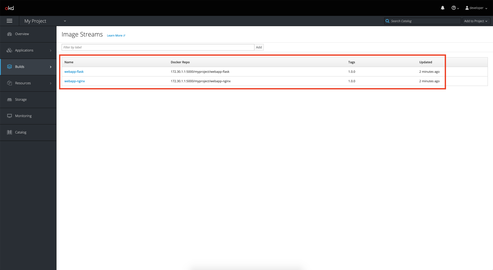


Alternatively, you can list the Image Streams via the CLI:
```bash
$ oc get is -n myproject
```

##### Deploy the images

First, ensure that you are in the correct project space:
```bash
$ oc project myproject
```

Next, deploy the images by creating a Deployment Configuration.  
We can also specify environment variables when we create our application:

```bash
$ oc new-app --image-stream webapp-flask:1.0.0 -e MY_ENV_VAR="Hello beautiful environment!"
$ oc new-app --image-stream webapp-nginx:1.0.0
```

You should see the two applications deploy in the [Overview](https://172.28.33.20:8443/console/project/myproject/overview) page.    
There should also be a Service object that is created for each application, to allow for cluster-internal traffic.

Notice however that the NGINX container is failing.

If you look at the [logs](https://172.28.33.20:8443/console/project/myproject/browse/rc/webapp-nginx-1?tab=logs),
you'll find that the NGINX application is failing with the following error:

```
nginx: [emerg] host not found in upstream "flask" in /opt/bitnami/nginx/conf/server_blocks/app.conf:8
```

This is because, while we were able to reference the hostname of the flask service as specified in the
docker-compose.yml file in the previous workshop, we need to reference the service by a 
defined Service object for the flask application in OpenShift instead.

To resolve this issue, we must edit our nginx/app.conf file, and replace "flask" 
with the service hostname for the flask application in OpenShift - 
"[webapp-flask.myproject.svc](https://172.28.33.20:8443/console/project/myproject/browse/services/webapp-flask?tab=details)".
```bash
$ sed -i 's/flask/webapp-flask.myproject.svc/g' nginx/app.conf
```

Now, rebuild the NGINX image, tag, and push the new image to the integrated repository.
```bash
$ docker-compose build
$ docker tag webapp-nginx:latest docker-registry-default.172.28.33.20.nip.io:80/myproject/webapp-nginx:1.0.0
$ docker push docker-registry-default.172.28.33.20.nip.io:80/myproject/webapp-nginx:1.0.0
```

Notice how OpenShift automatically notices that a new image has been pushed to the repository, 
and has triggered a new deployment of the new image.  
This is because the Deployment Configuration object is set to trigger a new deployment upon any image change 
to the image "webapp-nginx:1.0.0", as referenced from the Image Stream object.

You can verify this configuration by describing the Deployment Configuration object yourself:
```bash
$ oc describe dc webapp-nginx
```
or in yaml format:
```bash
$ oc get dc webapp-nginx -o yaml
```

At this point, your project space should look like the following:
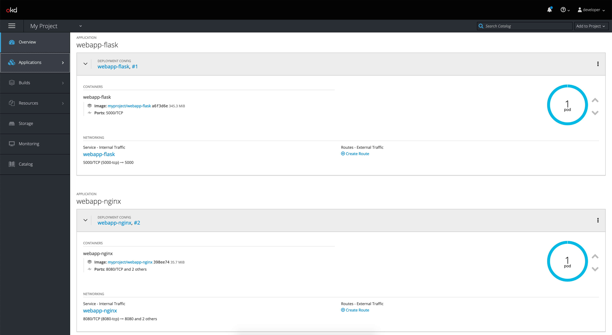

##### Create the route
The last thing we need to do, is expose a route for the webapp-nginx service
so that we can access our application from outside the cluster:

```bash
$ oc expose svc webapp-nginx --port=8082
```

You should see that a route has now been created for the webapp-nginx application, targting port 8082. 

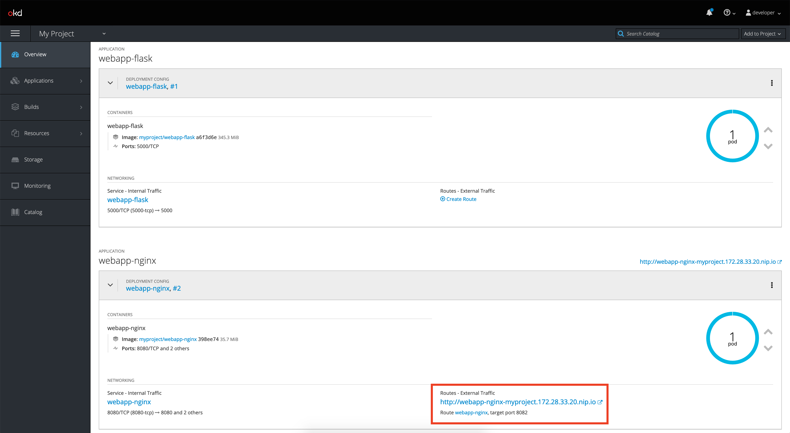

If you navgivate to http://webapp-nginx-myproject.172.28.33.20.nip.io in your browser now, 
you should see a "Hello World in Production!" page.

Congratulations, you have now deployed a multi-container application on OpenShift!


##### Understanding Labels
A Service object provides load balancing of traffic across a contained set of Pods.   
In order to identify all the Pods that are associated to a specific deployment, Labels are used.

Labels are key/value pairs that are attached to objects, such as Pods.
The link between Labels and Label Selectors defines the relationship between the Deployment and the Pods it creates.

Can you identify and trace the relationship via Labels and Label Selectors for the webapp-flask Pod(s) and webapp-flask
Service?

Note: Understanding lables and networking in k8s is foundational to being able to understand and implement 
more advanced monitoring and traffic routing patterns with tools such as 
[Prometheus](https://prometheus.io/) and [Istio](https://istio.io/).


### Using ConfigMaps and Secrets

#### Separating configurations from application code with ConfigMaps
A ConfigMap is a dictionary of configuration settings. 
This dictionary consists of key-value pairs of strings, that can then be injected into a container at runtime.  
Like with other dictionaries (maps, hashes, ...) the key lets you get and set the configuration value.

Using a ConfigMap allows you to keep your application code separate from your configuration.   
This is an important principle in ensure that your application is portable and reusable!  

Separating your application code from your configuations allows you easily change configuration settings 
depending on the environment (development, testing, production), and to dynamically change configuration at runtime.  
Using a ConfigMap to do so, will help you manage complex configurations for applications, instead of having to track
multiple environment variables.

Examples of common configuration settings include connection strings, hostnames, and URLs.

.INI files are a standard configuration format used by many applications, including uWSGI.    
Let's create a ConfigMap that contains the configuration settings for the uWSGI server that 
runs in the webapp-flask container.

First, modify the flask/app.ini file, which contains the configuration settings for the uWSGI server.
Let's change the number of uWSGI Workers from 2 to 5:

```bash
$ sed -i 's/workers = 2/workers = 5/g' flask/app.ini
```

Now create a ConfigMap called "uwsgi-config" from the app.ini file.
This will result in the filename "app.ini" being a key, and the contents of app.ini being the value to the key.

```bash
$ oc create configmap uwsgi-config --from-file=flask/app.ini
```

You should see the following response:
```
configmap/uwsgi-config created
```

Go ahead and describe the configmap, and notice how the contents of the app.ini file have been 
populated as a value to a key defined from the filename.
```bash
$ oc describe cm uwsgi-config 
```

Navigate to the [Config Maps page](https://172.28.33.20:8443/console/project/myproject/browse/config-maps) on the
OpenShift console. You should see that a configmap named "uwsgi-config" has been created in your project.

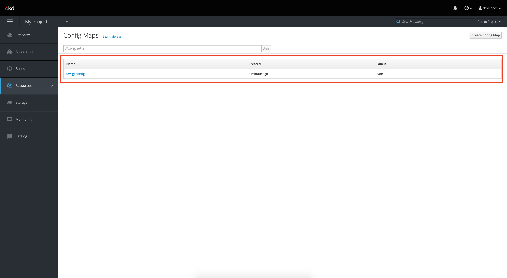

Now, let's edit the [Deployment Configuration for webapp-flask](https://172.28.33.20:8443/console/project/myproject/browse/dc/webapp-flask?tab=configuration), 
so that it injects the uwsgi-config ConfigMap into the container as a volume.
This will overwrite the original/default app.ini file that was copied over to the webapp-flask image as specified in it's Dockerfile.

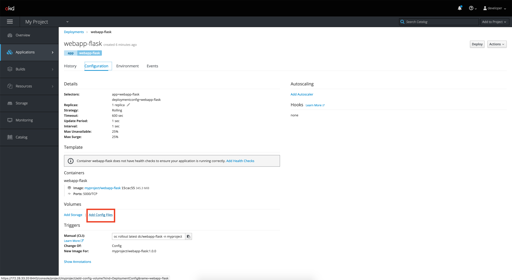

Configure the Source to be the "uwsgi-config" ConfigMap that we created, 
and the Mount Path settings to be "/etc/uwsgi/", which is the ENTRYPOINT that is specified in the Dockerfile 
for the webapp-flask image.

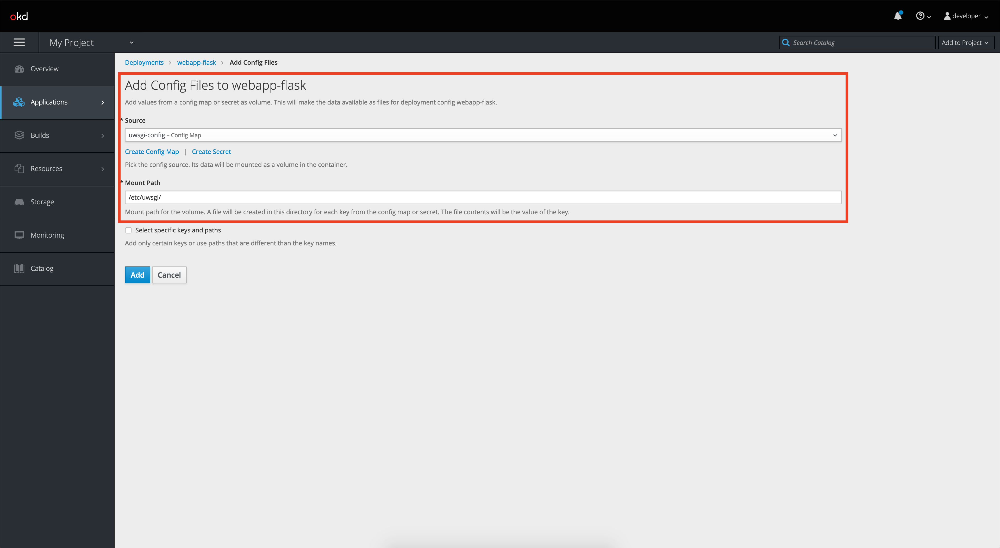

Add the volume, and you should see a 
[new deployment rollout](https://172.28.33.20:8443/console/project/myproject/browse/rc/webapp-flask-2?tab=details), 
with the volume containing the ConfigMap attached to the Pod(s).


Navigate to http://webapp-nginx-myproject.172.28.33.20.nip.io again, and you should see that the 
number of uWSGI workers is now 5 instead of 2.


#### Using secrets for sensitive data

Secret objects allow you store and manage sensitive information, such as passwords, OAuth tokens, and ssh keys.   
Putting this information in a secret is safer and more flexible than putting it verbatim in a Pod definition or in a container image. 

Secrets can be mounted as data volumes or be exposed as environment variables to be used by a container in a pod. 
They can also be used by other parts of the system, without being directly exposed to the pod.     
For example, they can hold credentials that other parts of the system should use to interact with external systems on your behalf.  

Let's create a Secret that is then exposed as an environment variable to be used by the webapp-flask container:

```bash
$ oc create secret generic my-secret --from-literal=SECRET=supersecretvalue
```

Navigate to the [Secrets page](https://172.28.33.20:8443/console/project/myproject/browse/secrets)
of your project, and you should see that a secret called "my-secret" has been created there.

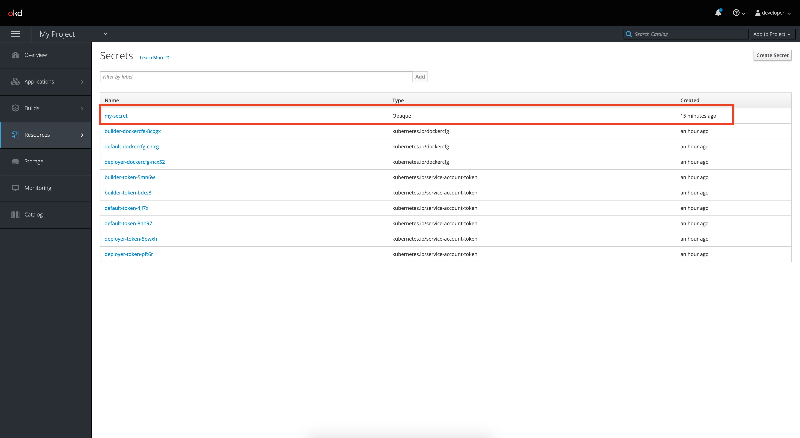

Now, let's edit the [Deployment Configuration for webapp-flask](https://172.28.33.20:8443/console/project/myproject/browse/dc/webapp-flask?tab=environment), 
so that it injects the my-secret Secret into the container as an environment variable.

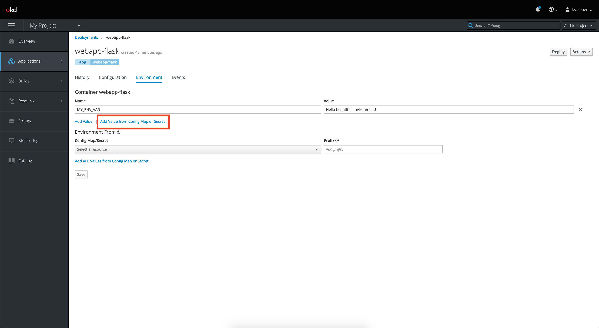


Set the environment variable name to "SECERT", select the "my-secret" Secret as the resource,
and "SECRET" as the key.
Then, click Save.

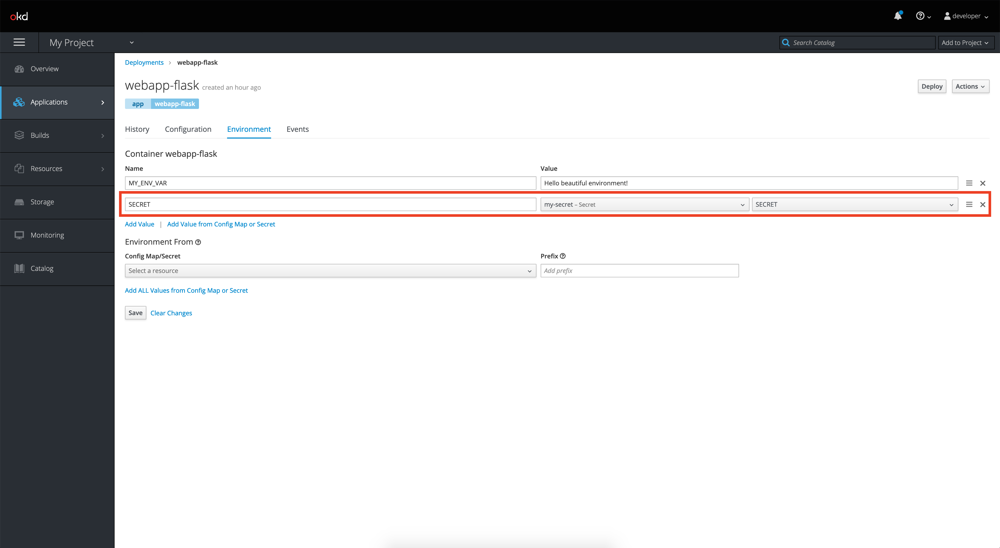

You should see a new deployment rollout.

Navigate to http://webapp-nginx-myproject.172.28.33.20.nip.io again, and you should see the secret value.

Note: The ironic thing is, secrets are actually not so secret in Kubernetes, since they are only base64 encoded.
This means, that anyone who has the permissions to be able to view secrets in your OpenShift project, 
can easily decode it:
```bash
$ oc get secret my-secret -o yaml | grep SECRET | tr -d " " | cut -d: -f2 | base64 --decode
```

The better alternative here, is to use a solution such as Hashicorp Vault to encrypt and centrally store, access, distribute,
and rotate dynamic secrets - but this is outside the scope of this workshop :wink: .


### Additional Training Resources
Hopefully, this excercise has given you an introduction into the capabilities that 
OpenShift and Kubernetes as a Platform-as-a-Service provides.

Obviously, there are a lot of things that you can do with OpenShift and Kubernetes
that we just don't have the time to cover in this workshop.

For additional resources and training, here are some interactive learning opportunities from the Red Hat team:
- learn.openshift.com
- try.openshift.com

There are also [illustrated children's books](https://www.cncf.io/phippy/) for learning about Kubernetes!


