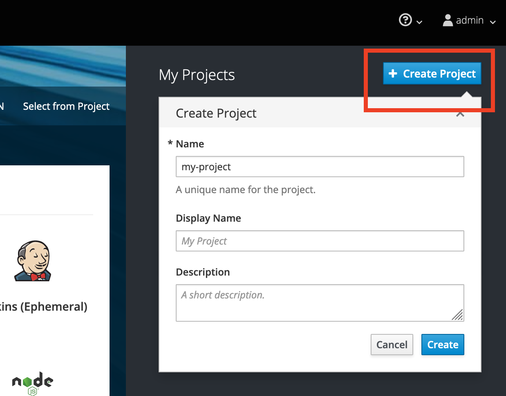
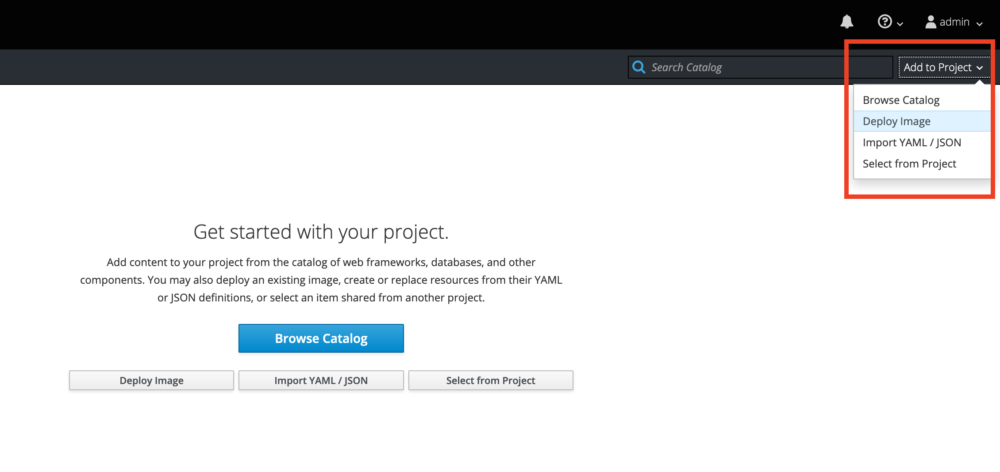
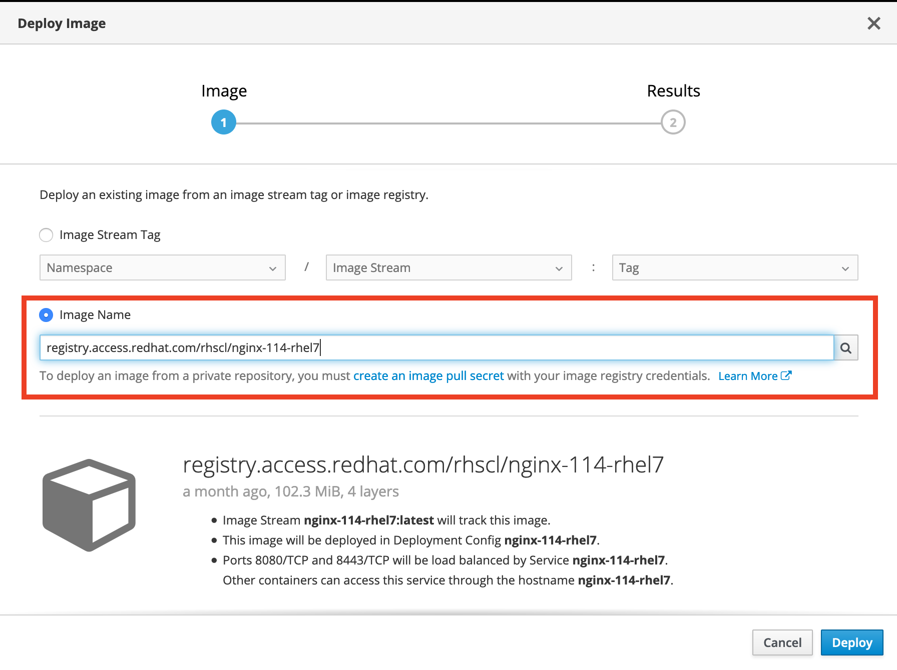

# Container Orchestration 

## Working with OpenShift
To start, ensure that the `openshift` VM is running on your local machine:
```bash
vagrant global-status --prune
```
You should see output similar to:
```sh
id       name      provider   state   directory
--------------------------------------------------------------------
4c56060  openshift virtualbox running /Users/<MSID>/devops_workshops
```

Navigate to the OpenShift UI at `https://172.28.33.11:8443/console/` in a web browser on your local machine.

You can login as an admin with the following credentials:
```
Username: admin
Password: admin
```

#### Create a Project
OpenShift Projects are the equivalent of Kubernetes namespaces.
Projects/Namespaces provide a logical way to divide cluster resources between multiple users/teams/environments.

To start, create a new project and name it "my-project":  



Then, navigate to your project.

#### Deploy a Docker image
Deploy a Docker image by navigating to the "Add to Project" tab.



Let's try deploying an NGINX server:


We're going to use the image version found on on the RedHat Container Catalog
because it provides a non-root container image. 
OpenShift by default, prevents containers from running as root as a security measure.

After clicking "Deploy", you should see OpenShift pull the image from DockerHub, and deploy it to your project space:


At this point, the application container is running, but the application is only accessible from within the cluster.
In order to make the application available externally, we need to create a route.

Go ahead and create a route. You can leave the defaults unchanged.
