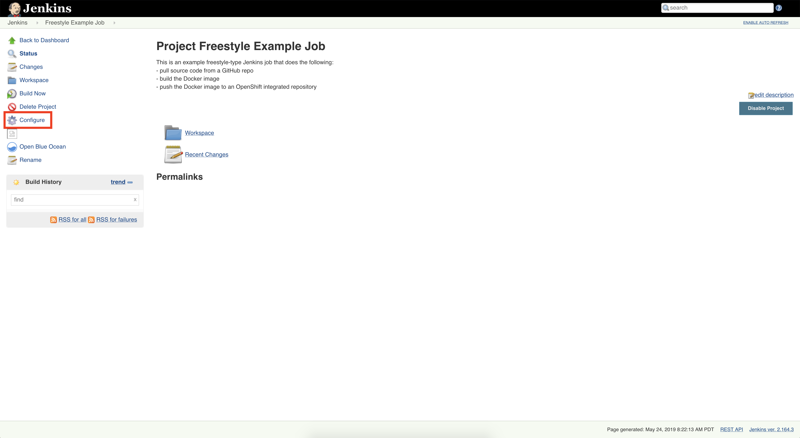
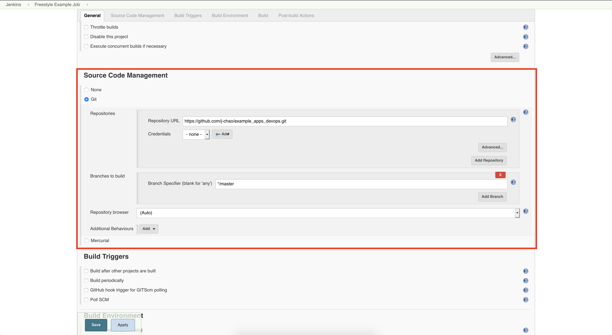
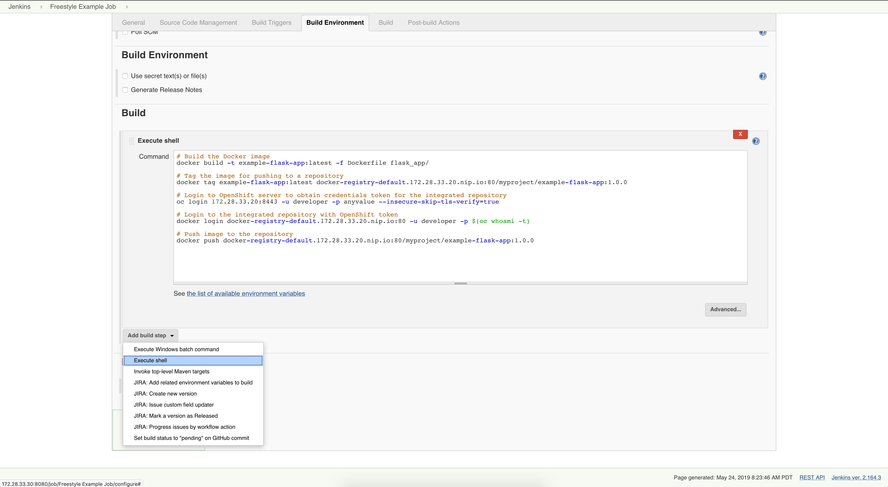
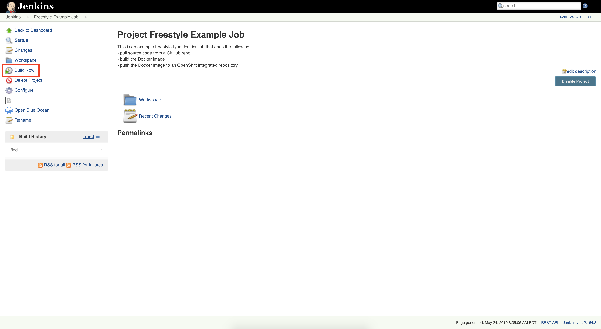
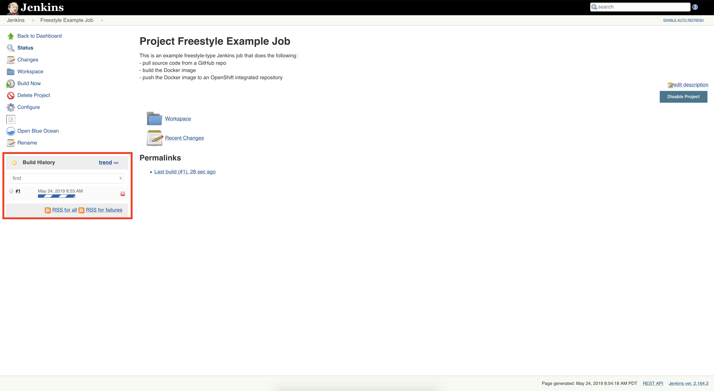
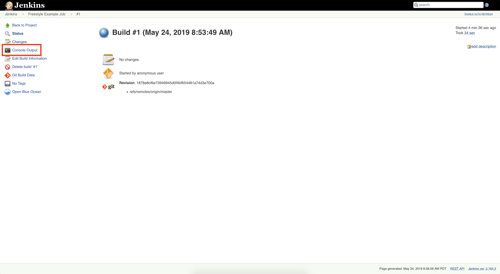
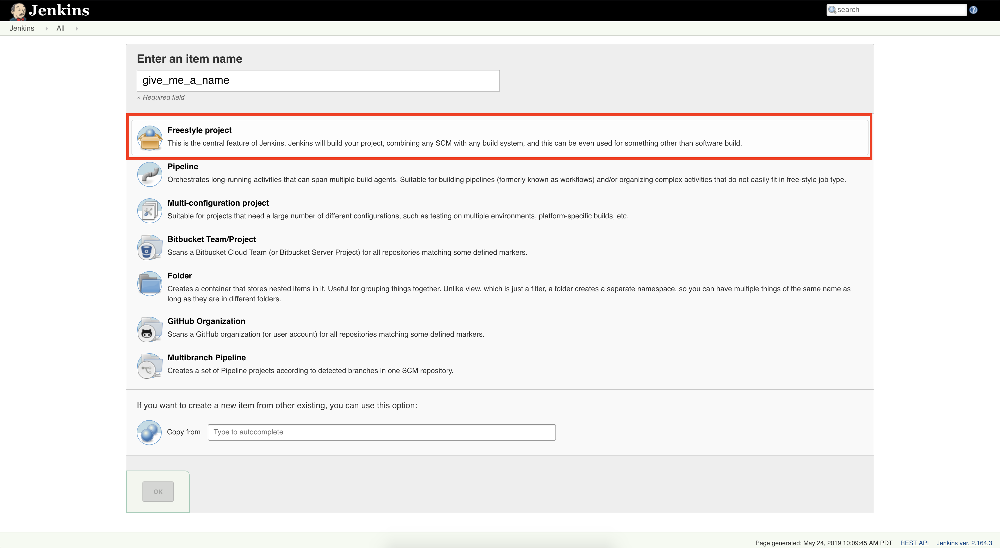

# Continuous Integration & Continuous Delivery Pipelines


## Working with Jenkins

To start, ensure that both the `jenkins` and `openshift` VMs are running on your local machine:
```bash
$ vagrant global-status --prune
```
You should see output similar to:
```sh
id       name      provider   state   directory
--------------------------------------------------------------------
2c97819  jenkins   virtualbox running /Users/<MSID>/devops_workshops
b2ca4f7  openshift virtualbox running /Users/<MSID>/devops_workshops
```

Navigate to the OpenShift Console at `https://172.28.33.20:8443/console/` in a web browser on your local machine.

Login to OpenShift as a developer with the following credentials:
```sh
Username: developer
Password: <any value>
```

In another browser window, navigate to the Jenkins UI at `http://172.28.33.30:8080`.
It may take a while for Jenkins to fully initialize.


### Managing Jenkins Projects

#### Freestyle Project

Once Jenkins is ready, the first page you'll see should look like the following:


Go ahead and take a look at the ["Freestyle Example Job"](http://172.28.33.30:8080/job/Freestyle%20Example%20Job/).  
This job does the following:
- pulls the source code for the example flask_app from a [GitHub repo](https://github.com/j-chao/example_apps_devops)  
- builds the Docker image
- pushes the Docker image to an OpenShift integrated repository

Select ["Configure"](http://172.28.33.30:8080/job/Freestyle%20Example%20Job/configure) on the left side to see how this "Freestyle"-type Jenkins job is setup:



The "Source Code Management" section is where we can define how Jenkins pulls the source code from a git repo.



Scroll down to the bottom of the page.   
Notice how in the "Build" section, you can define shell commands to run. 
There are also additional "build steps" and "post-build actions" that you can define as part of your pipeline to execute,  
depending on the plugins and integrations you have installed on your Jenkins server.  




Go ahead and execute the [Freestyle Example Job](http://172.28.33.30:8080/job/Freestyle%20Example%20Job/) 
by clicking on "Build Now."



You should see a Build kick-off:



Navigate to Build "#1", and follow the [Console Output](http://172.28.33.30:8080/job/Freestyle%20Example%20Job/1/console) to see the build in action.



Once the build is complete, you should be able to see that an image has been 
successfully pushed to the OpenShift integrated repository, and that
an [image stream](https://172.28.33.20:8443/console/project/myproject/browse/images) has been created
for the "example-flask-app".


Try [creating a Freestyle job](http://172.28.33.30:8080/view/all/newJob) that builds and deploys 
the Docker images for the example flask + NGINX multi-container application 
from the [GitHub repo here](https://github.com/j-chao/example_apps_devops) to OpenShift.




#### Pipeline Project

Jenkins is extremely extensible, and has integrations into many third-party tools.
So far, our CI/CD pipeline is relatively simple, but imagine having to define a multi-pipeline CI/CD infrastructure,  
with GitHub hooks that get triggered per your git-branching strategies and managing pull-requests.  

Add to that, additional tools and steps for validating functionality tests, code linting, security scans, 
performance tests, and compliance tests.

You may also want to integrate tools for notifying you and the team if a pipeline fails.
For example, if a unit test fails your pipeline execution, have Jenkins send an email to the team.  

Finally, add to that, the extension of your pipelines to higher environments, such as promoting code from development
environments to test, stage, and production.

You can see that very quickly, the idea of having to define all of this via the Jenkins UI 
in a "freestyle" project is not the best.

Fortunately, we have the ability to define all of our pipelines as code in the form of a  
["Jenkinsfile"](https://jenkins.io/doc/book/pipeline/jenkinsfile/).


A Pipeline's Jenkinsfile can be written in a text editor or an integrated development environment (IDE) and committed to source control 
with the application code that Jenkins will build. 
Jenkins can then check out the Jenkinsfile from source control as part of the Pipeline's build process, and then proceed to execute the Pipeline
as it's defined in the Jenkinsfile.

The following is an example Jenkinsfile that defines a Jenkins Pipeline Job 
that does the exactly the same thing as the Freestyle Job we first looked at, 
except it also adds in a step for running unit tests.

```groovy
#!/usr/bin/env groovy 
pipeline {

  agent any

  stages {
      
    stage("Git Checkout") {
      steps {
        checkout([$class: 'GitSCM', branches: [[name: 'master']],
        userRemoteConfigs: [[url: 'https://github.com/j-chao/example_apps_devops']]])
      }
    }

    stage("Run Unit Tests") {
      steps {
        sh '''
          python3 -m unittest flask_app/app_test.py -v
          '''
      }
    }

    stage("Build Docker Image") {
      steps {
        sh '''
          docker build -t example-flask-app:latest flask_app/
          '''
      }
    }

    stage("Tag Docker Image") {
      steps {
        sh '''
          docker tag example-flask-app:latest docker-registry-default.172.28.33.20.nip.io:80/myproject/example-flask-app:1.0.0
          '''
      }
    }

    stage("Login to OpenShift Integrated Repository") {
      steps {
        sh '''
          oc login 172.28.33.20:8443 -u developer -p anyvalue --insecure-skip-tls-verify=true
          docker login docker-registry-default.172.28.33.20.nip.io:80 -u developer -p $(oc whoami -t)
          '''
      }
    }

    stage("Push Image to Repository") {
      steps {
        sh '''
          docker push docker-registry-default.172.28.33.20.nip.io:80/myproject/example-flask-app:1.0.0
          '''
      }
    }

  }
}

```

Take a look at the Example Pipeline Job now, and see if you can understand how it's 
configured different than the Example Pipeline Job.  

Try running the Example Pipeline Job, and notice how you can also view the different stages of the pipeline,
as they're defined.


### Exploring Jenkins

Of course, there are a lot of things that you can do with Jenkins
that we just don't have the time to cover in this workshop.

Take some time to explore the Jenkins interface, and be inspired by the possibilities:
- [Open Blue Ocean](http://172.28.33.30:8080/blue/organizations/jenkins/pipelines)
- [Jenkins Plugins](http://172.28.33.30:8080/pluginManager/available)
- [Manage Jenkins](http://172.28.33.30:8080/manage)

Explore the [documentation](https://jenkins.io/) as well!

