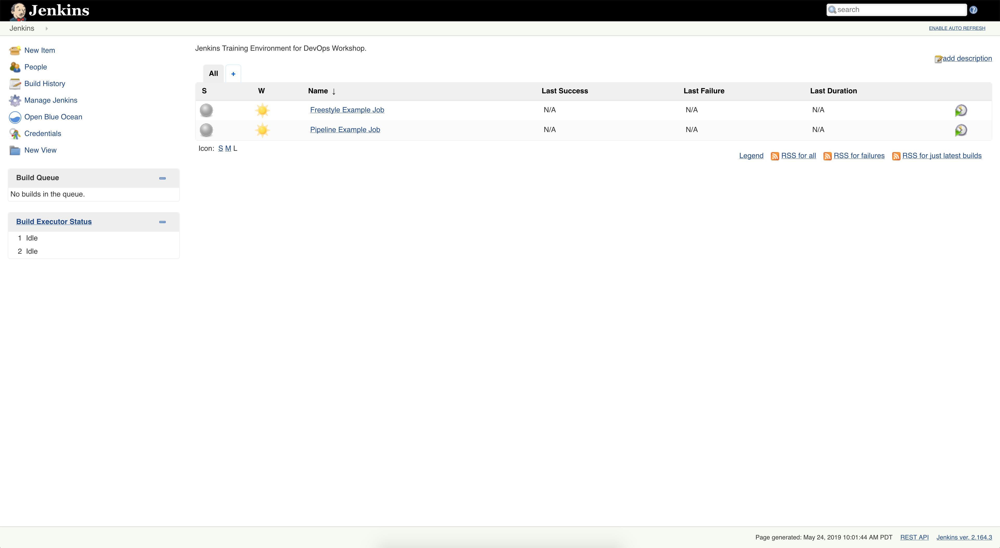

# Continuous Integration & Continuous Deployment Pipelines


## Working with Jenkins

To start, ensure that both the `jenkins` and `openshift` VMs are running on your local machine:
```bash
$ vagrant global-status --prune
```
You should see output similar to:
```
id       name      provider   state   directory
--------------------------------------------------------------------
2c97819  jenkins   virtualbox running /Users/<MSID>/devops_workshops
b2ca4f7  openshift virtualbox running /Users/<MSID>/devops_workshops
```

Navigate to the Jenkins UI at `https://172.28.33.20:8443/console/` in a web browser on your local machine.

Login to OpenShift as a developer with the following credentials:
```bash
Username: developer
Password: <any value>
```

In another browser window, navigate to the Jenkins UI at `https://172.28.33.30:8080` on your local machine.
It may take a while for Jenkins to fully initialize.


### Managing Jenkins Jobs

#### Freestyle Project

Once Jenkins is ready, the first page you'll see should look like the following:



Go ahead and take a look at the ["Freestyle Example Job"](http://172.28.33.30:8080/job/Freestyle%20Example%20Job/).  
This job does the following:
- pulls the source code for the example flask_app from a [GitHub repo](https://github.com/j-chao/example_apps_devops)  
- builds the Docker image
- pushes the Docker image to an OpenShift integrated repository

Select ["Configure"](http://172.28.33.30:8080/job/Freestyle%20Example%20Job/configure) on the left side to see how this "Freestyle"-type Jenkins job is setup:


The "Source Code Management" section is where we can define how Jenkins pulls the source code from a git repo.


Scroll down to the bottom of the page.   
Notice how in the "Build" section, you can define shell commands to run. 
There are also additional "build steps" and "post-build actions" that you can define as part of your pipeline to execute,  
depending on the plugins and integrations you have installed on your Jenkins server.  


Go ahead and execute the [Freestyle Example Job](http://172.28.33.30:8080/job/Freestyle%20Example%20Job/) 
by clicking on "Build Now."


You should see a Build kick-off:


Navigate to Build "#1", and follow the [Console Output](http://172.28.33.30:8080/job/Freestyle%20Example%20Job/1/console) to see the build in action.


Once the build is complete, you should be able to see that an image has been 
successfully pushed to the OpenShift integrated repository, and that
an [image stream](https://172.28.33.20:8443/console/project/myproject/browse/images) has been created
for the "example-flask-app".

#### Pipeline Project
